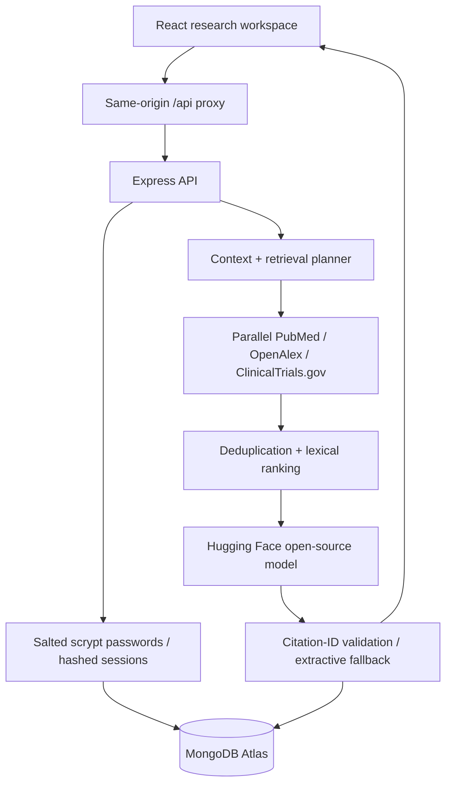

# CuraLink

An educational medical research workspace for patients, caregivers, clinicians and researchers. Search PubMed, OpenAlex and ClinicalTrials.gov, inspect citations, compare publications, and save research with a username/password account.

[Live showcase](https://curalink-submission.vercel.app) · [API health](https://curalink-api-i2r2.onrender.com/api/health)

The deployed showcase may lag the current repository until the frontend and API are redeployed. Free Render instances can take about a minute to start after inactivity.

## Features

### Flagship: trial discovery

The workspace opens with the medical research chat. The Find trials tool supports the conversation with a structured registry search. Enter a condition, location and optional age; expand options for intervention, recruitment status, phase and screening context. The registry query preserves requested location and enrollment constraints. It scans up to 100 records over two pages, reports coverage and phase exclusions, and never silently broadens an empty search.

Trial cards show registry facts and preliminary screening counts. Open a checklist to inspect the exact fields or passages behind observations. Age and sex conflicts remain visible; medication and comorbidity mentions require review rather than automatic clinical interpretation. Compare up to four trials, save a shortlist, and export registry facts plus questions for the study coordinator. This path does not call Hugging Face.

Screening matches are limited observations, not confirmed eligibility. Location is text-matched, not a radius calculation. A study can be recruiting overall while a particular site is closed. Search snapshots and bookmarked records are saved per account.

- Patient and clinician workspaces with quick-start research questions and editable context.
- Account-scoped conversation history, source bookmarks, notes and Markdown brief export.
- Clickable citations tied to each answer's own evidence snapshot.
- Available abstracts, source metadata, ranking rationale and research traces.
- Publication comparison using explicitly labeled abstract sections; absent details remain unknown.
- Clinical-trial status, phase, location and age filters on the selected shortlist.
- Dedicated registry search with strict location/enrollment constraints, bounded pagination, saved screening profiles and explicit coverage.
- Structured registry age limits and preliminary eligibility conflict flags.
- Parallel provider retrieval, deduplication, BM25/keyword/metadata ranking and intent-aware shortlists.
- Streamed pipeline progress and labeled source-only responses when inference fails or is unavailable.
- Account-free sample workspace with illustrative records, clearly separated from live evidence.
- Medical disclaimer, Terms of Use, Privacy Notice and registration acknowledgment.
- Backend/integration tests, desktop/mobile browser tests, accessibility scans, shared TypeScript API contracts and CI.
- In-app benchmark dashboard with recorded results and explicit methodology limits.

## Architecture



Production inference uses Hugging Face's model router. No custom model training or fine-tuning is claimed. Citation-ID validation rejects references outside the supplied source set; it does not independently establish claim support or clinical accuracy.

## Local setup

Requires Node 22.12 or later.

```bash
npm ci
```

Copy `.env.example` to `server/.env`, then:

```bash
npm run dev
```

The client runs at `http://localhost:5173` and the API at `http://localhost:5000`. Vite proxies `/api` locally. The frontend intentionally uses relative API paths so authentication cookies remain same-origin.

- `MONGODB_URI`: persistent accounts, sessions and workspaces. Use the intended Atlas database name in the connection string. The existing `test` database can be used for the showcase; separate it if other projects share that database.
- `HF_API_TOKEN`: optional inference token. Without it the app returns clearly labeled source excerpts, not generated conclusions.
- `CLIENT_ORIGIN`: allowed frontend origins, comma-separated.
- Provider and candidate limits are documented in `.env.example`.

Without MongoDB, local accounts and workspaces use temporary in-memory storage and disappear on restart. The UI displays this state. Passwords are salted and hashed with Node's scrypt. Session cookies are HttpOnly, Secure in production, SameSite=Lax, and expire after seven days; stored session tokens are hashed.

## Deployment on the existing free-tier stack

### Render API

Root directory: `server`. Build: `npm install`. Start: `npm start`.

Set:

```text
NODE_ENV=production
CLIENT_ORIGIN=https://curalink-submission.vercel.app,http://localhost:5173
MONGODB_URI=<existing Atlas connection string including database name>
HF_API_TOKEN=<existing Hugging Face token>
```

Optional model and NCBI settings are in `.env.example`. No additional hosted authentication, vector database or paid service is required.

### Vercel frontend

Root directory: `client`. Build: `npm run build`. Output: `dist`.

`client/vercel.json` proxies `/api/*` to the existing Render API. It must remain before the SPA catch-all rewrite. The old `VITE_API_BASE_URL` is no longer used; relative API requests support the first-party authentication cookie.

Deploy the backend and frontend together because the updated API requires accounts and server-created workspace IDs. Existing unowned prototype conversations are not exposed to new accounts. The upgrade does not automatically claim or delete them.

## Free-tier limits

- At most 30 workspaces per account, 40 bookmarks per workspace and 60 recent turns retained per workspace.
- Five research starts per minute per account; one active research request per workspace.
- Provider calls have timeouts and bounded retries. The shared in-process public-search cache holds at most 20 shortlists and expires after 15 minutes.
- Private profile searches are excluded from the shared cache. Public source snapshots are retained with responses for citation provenance.
- Model generation has a global deadline, bounded context and fallback models. The UI reports the actual response mode.
- No scheduled polling, background AI jobs, hosted embedding database or paid tier is needed.
- Application limits cannot guarantee a billing ceiling. Keep provider billing disabled or capped in the provider dashboard; free allowances and policies can change.

## Checks and evaluation

```bash
npm run lint
npm run typecheck
npm test
npm run evaluate
npm run build
npm exec --workspace client -- playwright install chromium
npm run test:e2e
```

`npm run ci:check` runs the complete check sequence. Tests use mocked providers and do not call live inference. GitHub Actions installs Chromium and runs the same checks.

The evaluator runs 48 synthetic queries across 12 topics, comparing keyword-only ranking with BM25/metadata ranking. See [evaluation methodology](server/evaluation/README.md). These are mechanical regression fixtures, not clinical validation. An optional local Python embedding experiment is supplied but is not enabled in production or required for setup.

API contracts are in `shared/contracts.ts`; the API client is checked with TypeScript. React components and the backend currently remain JavaScript.

## Medical and privacy scope

CuraLink is a portfolio prototype, not medical advice, diagnosis, treatment or an emergency service. It is not designed for protected health information and makes no healthcare compliance claim. Use fictitious or non-identifying context. Questions and selected context go to research providers and, when enabled, Hugging Face and its model provider.

The in-app Medical Disclaimer, Terms and Privacy Notice describe processing, access and limitations. Clinical-trial matches always require study-team confirmation. Source links and excerpts must be independently reviewed.

## Known limitations

- The search is abstract-based and not a systematic review. Full text, systematic evidence grading and claim entailment validation are not implemented.
- Natural-language condition/profile extraction is heuristic; users can edit context. Trial filters operate on a shortlist, not the entire registry.
- Comparison fields are extracted only from explicit abstract labels; many sources do not report them.
- No password recovery or self-service account deletion. Workspace deletion is available; administrative account requests can be raised with the project owner.
- Rate limits, caches and research locks are process-local and target the single-instance free-tier deployment.
- End-to-end browser tests mock the API, and integration tests use in-memory persistence. Atlas persistence and hosted proxy behavior need a deployment smoke test.
- Automated browser checks cover interactions, accessibility and horizontal overflow. A human visual review of the desktop/mobile screenshots is still needed.
- Benchmark scores should not be used to claim real-world medical retrieval quality. Local embedding experiments require separate installation and verification.

## Portfolio discussion points

Explain the tradeoffs behind mixed-source retrieval, partial failures, immutable citation snapshots, source-only degradation, account isolation, first-party cookie proxying, and lexical ranking under free-tier resource limits. Report benchmark results with their synthetic-data scope and measure real-world performance separately before claiming improvements.
